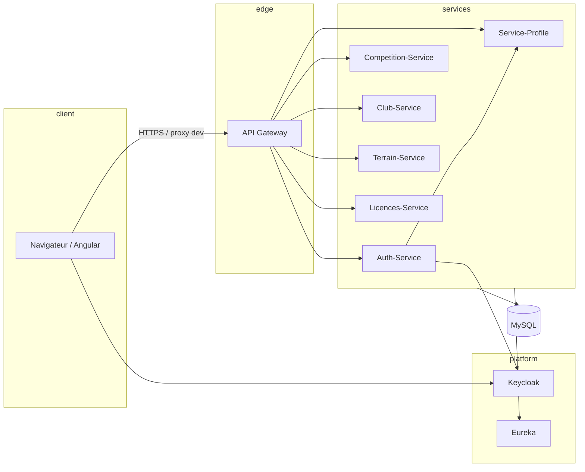

# FTTT App

Application web pour la gestion d’écosystèmes sportifs (fédération, clubs, compétitions, terrains, profils, licences, etc.). Le projet suit une **architecture microservices** côté backend et une **SPA Angular** côté frontend, avec authentification centralisée via **Keycloak** (JWT).

---

## Vue d’ensemble

- **Frontend** : Angular 20, Angular Material, routage par rôles (admin fédération, joueur, manager de club, coach, arbitre).
- **Backend** : plusieurs services Spring Boot (Java 21) exposant des API REST, persistance **MySQL** par service, découverte via **Eureka**, point d’entrée **API Gateway**, configuration optionnelle via **Spring Cloud Config**.
- **Identité** : **Keycloak** émet des jetons JWT ; les microservices agissent comme **resource servers** OAuth2 et valident les jetons selon l’émetteur configuré (`issuer-uri`).



---

## Fonctionnalités côté interface

Espaces et modules principaux (routes sous `/app` après connexion) :

| Zone | Description |
|------|-------------|
| Tableau de bord | Vue selon le rôle (admin, joueur, manager, coach, arbitre). |
| Utilisateurs | Gestion des utilisateurs (selon droits). |
| Clubs | Gestion des clubs. |
| Profils | Profils utilisateurs. |
| Licences | Licences. |
| Compétitions | Compétitions et lien avec les autres domaines. |
| Matchs | Matchs. |
| Classements | Classements. |
| Lieux / terrains | Venues / terrains. |

L’authentification passe par les écrans sous `/auth` ; les routes privées sont protégées par des garde-fous (`authGuard`, `roleGuard`).

---

## Stack technique

| Composant | Technologie |
|-----------|-------------|
| API | Spring Boot 4.x, Spring Web, Spring Data JPA |
| Cloud | Spring Cloud (Gateway, OpenFeign, Eureka, Config Client) |
| Sécurité | Spring Security OAuth2 Resource Server, Keycloak |
| Données | MySQL 8, Hibernate |
| Frontend | Angular 20, RxJS, Angular Material |
| Build backend | Maven |
| Build frontend | npm / Angular CLI |

---

## Structure du dépôt

```
FTTT_App/
├── backend/                 # Microservices Spring Boot (un module Maven par service)
│   ├── Auth-Service/
│   ├── Sevice-Profile/      # Service profil (nom du dossier tel que dans le repo)
│   ├── Competition_Service/
│   ├── club-service/
│   ├── terrain-service/
│   ├── Licences-Service/
│   ├── Gateway-Service/
│   ├── Eureka-Service/
│   ├── ConfigServer-service/
│   └── docker-compose.yml   # Orchestration optionnelle (MySQL, Keycloak, images, etc.)
└── frontend/                # Application Angular (FTTTApp)
```

---

## Microservices et ports (référence)

Les ports peuvent varier selon `application.properties` ou les variables d’environnement. Ordre de grandeur utilisé dans le dépôt / `docker-compose` :

| Service | Rôle | Port indicatif |
|---------|------|----------------|
| Config Server | Configuration centralisée (optionnel) | 8888 |
| Eureka | Annuaire des services | 8761 |
| Gateway | Routeur API unique | 8090 |
| Auth-Service | Inscription, login, intégration Keycloak | 8082 |
| Competition-Service | Compétitions | 8081 |
| Licences-Service | Licences | 8087 |
| Service-Profile | Profils | 8096 |
| Club-Service | Clubs | 9002 |
| Terrain-Service | Terrains / lieux | 9008 |
| Keycloak | IAM (souvent en conteneur sur le port 8080 ; adapter l’URL selon votre installation) |  9090 |

Chaque service utilise en général **sa propre base MySQL** (schéma dédié), créée ou mise à jour via JPA (`ddl-auto` typiquement `update` en développement).

---

## Prérequis

- **JDK21** (aligné sur les `pom.xml` du backend).
- **Maven3.9+**
- **Node.js** et **npm** (pour Angular 20).
- **MySQL 8** en local ou via Docker.
- **Keycloak** configuré (realm, client confidentiel pour le backend, rôles, etc.).

---

## Démarrage rapide

### Backend (IDE ou ligne de commande)

1. Démarrer **MySQL**, puis **Eureka** (et la **Gateway** si vous passez tout par `8090`).
2. Pour chaque microservice : ouvrir le module, vérifier `src/main/resources/application.properties` (URL JDBC, utilisateur, mot de passe, URL Eureka, `issuer-uri` Keycloak).
3. Lancer la classe principale `*Application` du service.

Certains modules proposent un profil `docker` (`application-docker.properties`) pour tourner derrière Docker Compose avec des noms d’hôtes de services (`mysql`, `eureka`, `keycloak`, etc.). En développement local hors Docker, les URLs pointent en général vers `localhost`.

### Auth-Service et Keycloak

- Renseigner le **secret client** Keycloak (client backend confidentiel), par exemple via `keycloak.client-secret` ou la variable d’environnement `KEYCLOAK_CLIENT_SECRET`.
- Vérifier que le client dispose des **droits de service account** nécessaires (ex. gestion des utilisateurs dans le realm) si l’inscription est gérée côté Auth-Service.

### Frontend

```bash
cd frontend
npm install
npm start
```

Le fichier `frontend/proxy.conf.json` redirige les préfixes `/api` vers la Gateway et peut cibler directement certains services en développement local (ex. auth, profils) pour éviter les erreurs si la Gateway ou Eureka ne sont pas démarrés.

---

## Sécurité et identité (JWT)

1. L’utilisateur s’authentifie auprès de **Keycloak** et obtient un **JWT**.
2. Le navigateur envoie le JWT (en-tête `Authorization: Bearer ...`) vers la Gateway ou les services.
3. Chaque microservice **resource server** valide la signature et les claims du jeton (issuer, audience selon configuration).
4. Les appels **inter-services** (ex. OpenFeign) peuvent nécessiter de **propager le token** ou d’utiliser un jeton de service selon les endpoints ; la configuration exacte est dans chaque module (filtres Security, clients Feign).

---

## Docker Compose (optionnel)

Le fichier `backend/docker-compose.yml` permet de lancer l’infrastructure (MySQL, Keycloak, Eureka, Gateway, images des microservices, etc.). Les variables d’environnement dans ce fichier peuvent différer des valeurs par défaut du dépôt pour un run **100 % local** dans l’IDE : toujours **aligner** URLs, ports et mots de passe entre conteneurs, `application.properties` et le frontend.

---

## Licence

À préciser selon la politique du projet / de l’organisation.
